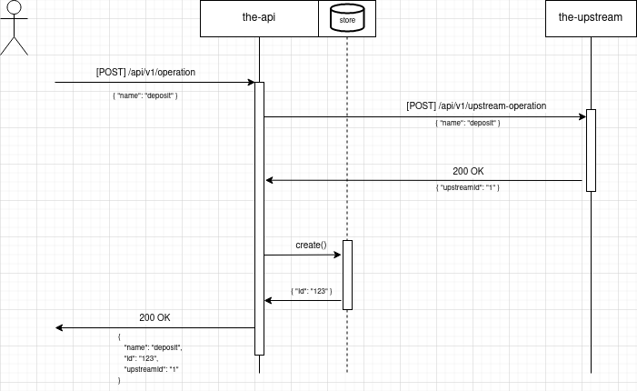

# Prerequisites

`go v1.18+`

# Sequence 



# Apps

# the-api
```sh
cd the-upstream
go build
```

## Args

Args  | Description | Required | Default
------| ------------|----------| --------
port  | app port    | false    | 8080
upstreamHost | host/ip of the-upstream app | false    | 127.0.0.1
upstreamPort | port of the-upstream app | false    | 8081
simulateNetworkPartition | simulate a random network partition event between the-api and the-upstream apps | false | false


## Endpoints

Method | Path | Description 
-------| -----| ------------
GET    | /    | simple text-based hello page
GET    | /ready    | app is ready to accept requests
GET    | /network/status    | status of the network; one-of `normal`,`partitioned`
GET    | /api/v1/operations | get all operations
GET    | /api/v1/operation/{id} | get operation by ID
POST   | /api/v1/operation | create operation for data `{"name": "<value>"}`

# the-upstream

## Args

Args  | Description | Required | Default
------| ------------|----------| --------
port  | app port    | false    | 8081


## Endpoints

Method | Path | Description 
-------| -----| ------------
GET    | /    | simple text-based hello page
GET    | /ready    | app is ready to accept requests
POST   | /api/v1/upstream-operation | create an operation

# Run the exercise

1. start `the-upstream` app on a terminal

(all args are optional)

```sh
cd the-upstream
go build
./the-upstream [-port=<port>]
```

2. start `the-api` on a separate terminal

(all args are optional)

```sh
cd the-api
go build
./the-api [-port=<port>] [-upstreamHost=<upstream-host>][-upstreamPort=<upstream-port>] [-simulateNetworkPartition=<bool>]
```

3. use cURL or a Rest client such as postman to interact with `the-api`'s endpoints

